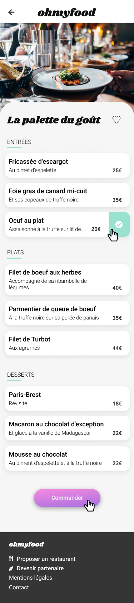
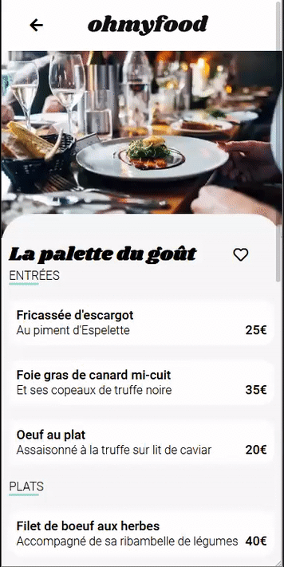

 

<h1 align="center">Projet n° 3</h1>
 

**Introduction** 

 

"Ohmyfood !" site de commande de repas dans différents restaurants est le troisième projet que je dois réaliser dans 
le cadre de ma formation "développeur web" avec le site de formation **OpenClassrooms**.

Pour ce projet, je suis développeur web junior dans une société qui propose un outil de réservation de menus.

Mon rôle consiste à intégrer les maquettes graphiques en utilisant uniquement *HTML* et *CSS*, l'utilisation de *Sass* étant un plus. 

 

***************

 

**Les maquettes**

 

Pour ce projet j'ai à ma disposition 5 maquettes mobiles :

 

1. Une page d'accueil

 

 

2. 4 pages menus (Sur le même modèle)

 

 

3. Les différentes animations demandées

 

 

Il me faut aussi intégrer une mise en page responsive pour les tablettes et les ordinateurs mais de façon plus libre.

 

**************************

 

**Les contraintes techniques sont :**

 

 
 *  Versionning du code
 * La charte graphique se compose des trois couleurs suivantes :
 
    * *Primaire* = #9356DC
    * *Secondaire* = #FF79DA
    * *Tertiaire* = #99E2D0
    
* Les polices du site sont **Roboto** pour le corps et **Shrikhand** Pour les titres.
* Les icônes proviennent de la bibliotèque **Font Awesome**.
* Les cartes de restaurant doivent renvoyées sur leurs pages respectives.
* Un loading spinner qui dure entre 1 et 3 secondes doit apparaitre sur la page d'accueil au chargement.
* Au survol, la couleur de fond des boutons principaux devra légèrement s’éclaircir. L’ombre portée devra également être plus visible.
* À terme, les visiteurs pourront sauvegarder leurs menus préférés. Pour ça, un bouton "J’aime" en forme de coeur est présent sur la maquette. Au clic, il devra se remplir progressivement. Pour cette première version, l’effet peut être apparaître au survol au lieu du clic.
* Les animations demandées doivent être fonctionnelles sur les pages de menu.
* Le code ne doit présenter aucune erreur au validateur W3C

 

************************

